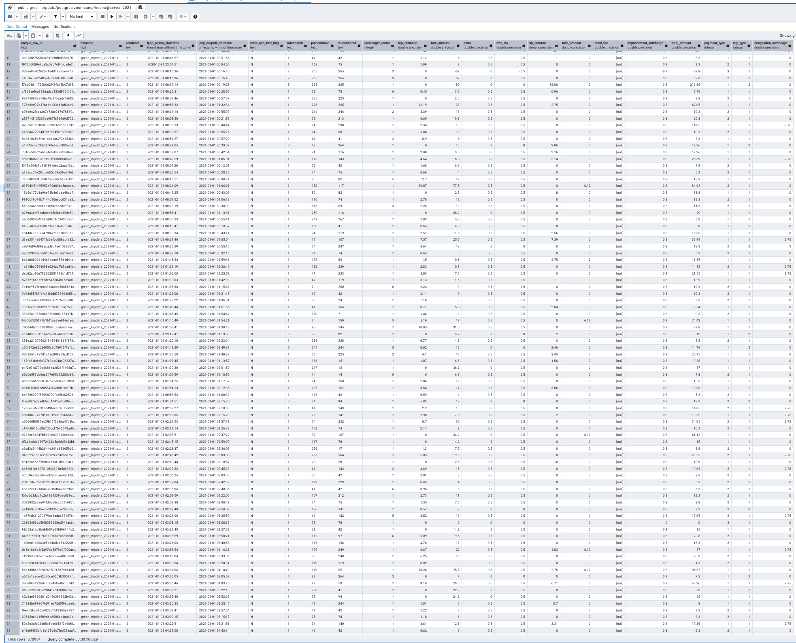

# HW PROCESS

* I WILL BE USING THE BACKFILL APROACH FROM OUR PAST EXAMPLES

* STEP 1: Create a docker-compose file to have Kestra, Postgres, and PGAdmin together.  
* STEP 2: I USED THE MANUAL WORKFLOW TO LOAD THE DATA FOR 2021 GREEN AND THE BACKFILL FOR THE 2021 YELLOW

NOW WE HAVE ALL THE 7 MONTHS OF GREEN DATA FOR 2021

SILAR THING FOR YELLOW 2021 DATA

* STEP 3: NOW WE NEED THE DATA IN THE CLOUD - WILL BE USING THE PIPELINE FOR GCP AND INCLUDING THE DATA FROM 2021

